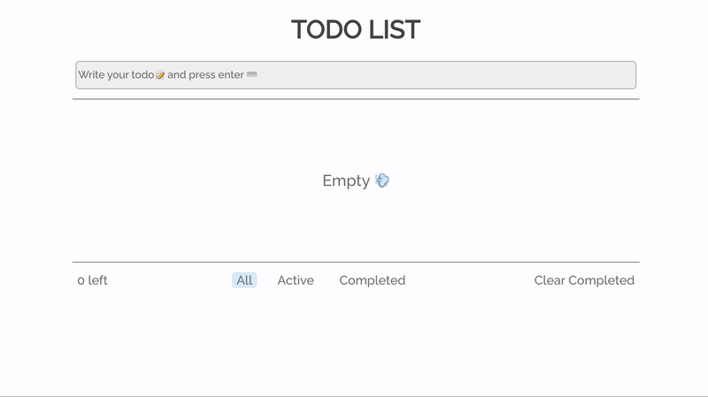
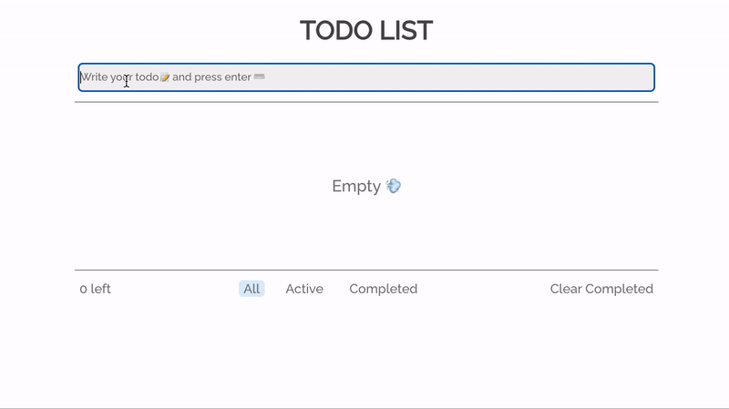
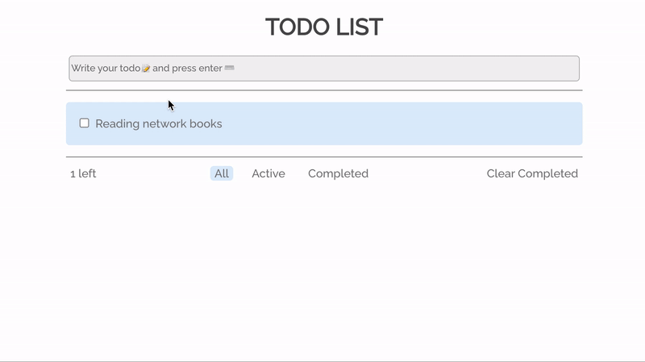
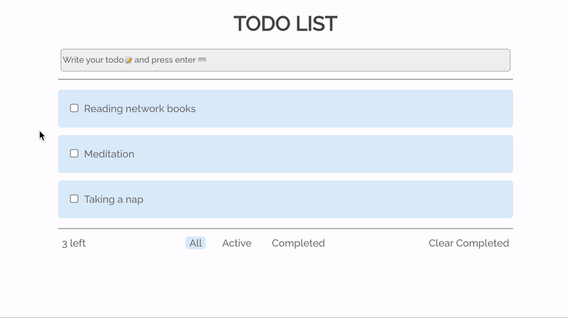
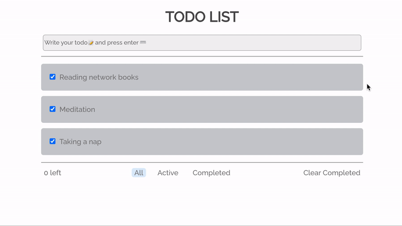

# TodoApp

## 목차

* [개요](##개요)
* [기간](##기간)
* [기술 스택](##기술_스택)
* [목표](##목표)
* [성과](##성과)
* [기능](##기능)

## 개요

- React를 사용한 Todo App 제작
- 상태 관리 라이브러리 Redux를 사용해 데이터 관리하기
- API 통신으로 데이터 주고받기

## 기간

* 2022.04.27 ~ 현재

## 기술 스택

- HTML
- CSS
- JavaScript
- React
- Redux

## 목표

- [x] Figma 사용해 [와이어프레임/스토리보드](https://github.com/cubodado/TodoApp/blob/main/docs/wireframe/wireframe_v.1.0.0.pdf) 만들기
- [x] Todo 추가 기능
- [x] Todo 완료 기능
- [x] Todo 삭제 기능
- [x] 남은 Todo 개수 세기 기능
- [x] Todo가 없을 경우 보이는 빈 화면
- [ ] Todo 상태별(All, Active, Completed)로 보기 구현
- [ ] 완료한 Todo 한번에 삭제하는 기능

## 성과

- Figma 사용해 유저 인터페이스 구성
- 와이어프레임대로 실제 화면 구현하기
- Redux 상태 관리 라이브러리로 Todo 데이터 관리하기
- API 통신을 통해 Todo 데이터 요청하기

## 기능

  
Todo가 없을 경우 보이는 빈 화면

  

  
Todo 추가

  

  
Todo 추가 예외 처리

  

  
Todo 완료 / 남은 Todo 개수 세기

  

  
Todo 삭제

  

